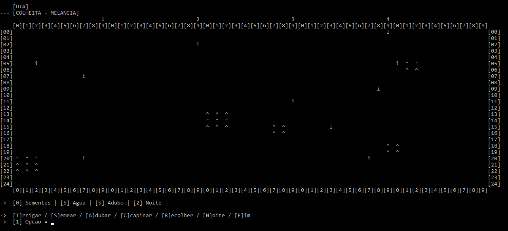

<h1 align="center">Plantação de Melancia</h1>

  

 

## 🍉 Sobre
  Projeto final do laboratório de Técnicas de Programação utilizando a linguagem C, desenvolvido utilizando as técnicas aprendidas durante o curso.
 
## 📑 Modo de jogar
  As ações do jogo acontecem pela escolha do usuário ao clicar nas teclas [i, s, a, r, c, n], respectivamente são:

  - Irrigar: primeira ação do jogo;

  - Semear: após irrigação, semeie para poder adubar;

  - Adubar: adubar para que a melancia vire uma muda;

  - Recolher: poderá recolher a melancia em dois estágios, broto (1 semente, 1 água) e madura (2 sementes, 2 águas, 2 adubo);

  - Capinar: tem chances de pegar sementes, capina as ervas daninhas (i / I) e os cordões de melancia (+); 

  - Noite: Toda noite chove, sendo assim, as ervas daninhas e plantas possuem uma porcentagem de crescimento, caso uma erva daninha creça a um bloco de distância da melancia a fruta morre. Anoite também há chances das melancias amadurecerem.

### 🔍 Observações
  - A cada 5 jogadas anoitece automaticamente, sendo assim, na quarta jogada não precisa utilizar das noites que tem disponível;
  - Jogando você irá perceber o nascimentos de '+' (cordão de melancia), ele tem uma porcentagem de chances de crescer ao lado de uma melancia madura, dá ao jogador 2 sementes e 2 quantidades de água.
